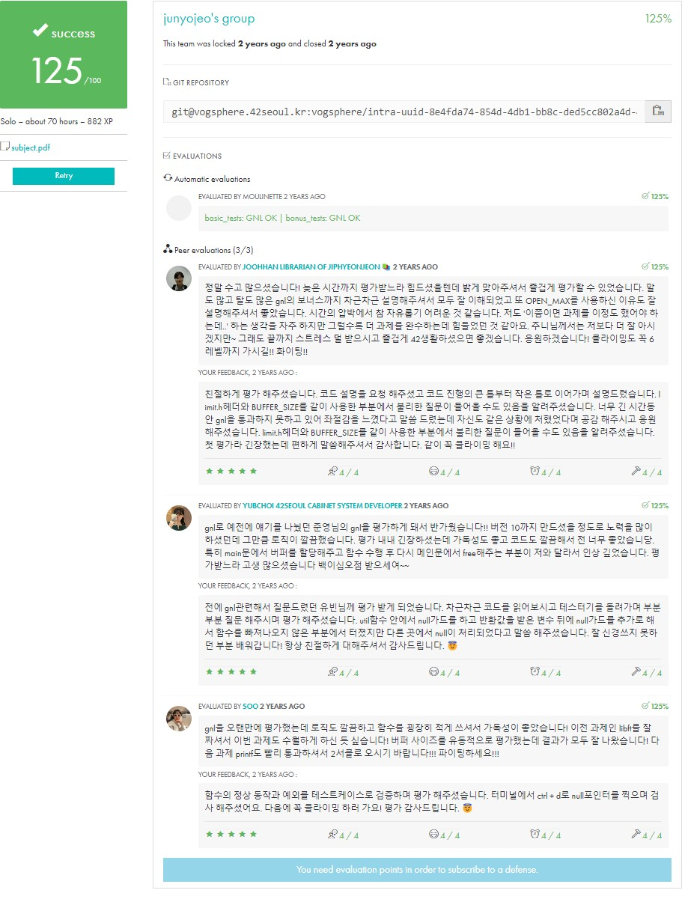

<div align="center">
  <h1>📖 get_next_line</h1>
  <p>42Seoul의 두 번째 프로젝트: 파일 읽기 함수 구현</p>

  

  [](https://github.com/junyjeon/get_next_line)
  [](https://github.com/42School/norminette)
</div>

## 📋 목차
1. [소개](#-소개)
2. [구현 상세](#-구현-상세)
3. [설치 방법](#️-설치-방법)
4. [사용 예시](#-사용-예시)
5. [트러블슈팅](#-트러블슈팅)

## 📝 소개

### 프로젝트 목표
파일이나 표준 입력으로부터 개행문자(`\n`)를 기준으로 한 줄씩 읽어오는 함수를 구현합니다.

### 개발 제약사항
- 허용 함수: `read`, `malloc`, `free`
- 정적 변수 최대 1개 사용
- [Norminette](https://github.com/42School/norminette) 코딩 규칙 준수
- 메모리 누수 없어야 함
- BUFFER_SIZE 매크로를 통한 버퍼 크기 조절 가능

## 💡 구현 상세

### 함수 프로토타입
```c
char *get_next_line(int fd);
```

### 주요 구현 사항
1. **정적 변수를 활용한 이전 읽기 내용 저장**
   ```c
   static char *backup[OPEN_MAX];
   ```

2. **버퍼 관리**
   ```c
   char *buffer;
   
   buffer = (char *)malloc(sizeof(char) * (BUFFER_SIZE + 1));
   if (!buffer)
       return (NULL);
   ```

3. **파일 읽기 처리**
   ```c
   ssize_t read_size;
   
   read_size = read(fd, buffer, BUFFER_SIZE);
   if (read_size == -1)
   {
       free(buffer);
       return (NULL);
   }
   ```

4. **개행 문자 처리**
   ```c
   char *find_newline(const char *s)
   {
       size_t i;

       i = 0;
       while (s[i])
       {
           if (s[i] == '\n')
               return ((char *)&s[i]);
           i++;
       }
       return (NULL);
   }
   ```

## ⚙️ 설치 방법

1. 저장소 클론
```bash
git clone https://github.com/junyjeon/get_next_line.git
cd get_next_line
```

2. 컴파일
```bash
cc -Wall -Wextra -Werror -D BUFFER_SIZE=42 get_next_line.c get_next_line_utils.c
```

## 📖 사용 예시

### 기본 사용법
```c
#include "get_next_line.h"
#include <fcntl.h>

int main(void)
{
    int     fd;
    char    *line;

    fd = open("test.txt", O_RDONLY);
    while ((line = get_next_line(fd)))
    {
        printf("%s", line);
        free(line);
    }
    close(fd);
    return (0);
}
```

### 여러 파일 동시 처리
```c
int     fd1 = open("file1.txt", O_RDONLY);
int     fd2 = open("file2.txt", O_RDONLY);
char    *line;

line = get_next_line(fd1);
printf("File1: %s", line);
free(line);

line = get_next_line(fd2);
printf("File2: %s", line);
free(line);
```

## 🔧 트러블슈팅

### 주요 체크포인트
1. **메모리 누수**
   - 모든 malloc된 메모리 free 확인
   - 에러 상황에서의 메모리 해제

2. **파일 디스크립터 유효성**
   - fd < 0 체크
   - OPEN_MAX 범위 체크
   - read() 반환값 처리

3. **버퍼 크기**
   - BUFFER_SIZE <= 0 처리
   - 큰 BUFFER_SIZE 처리
   - 작은 BUFFER_SIZE 처리

### 성능 최적화
1. 불필요한 문자열 복사 최소화
2. 메모리 할당 횟수 최소화
3. 정적 변수 효율적 관리

## 📚 참고 자료
- [파일 디스크립터](https://www.geeksforgeeks.org/input-output-system-calls-c-create-open-close-read-write)
- [정적 변수](https://www.geeksforgeeks.org/static-variables-in-c)
- [read 함수](https://man7.org/linux/man-pages/man2/read.2.html)
- [Norminette 규칙](https://github.com/42School/norminette/blob/master/pdf/en.norm.pdf)